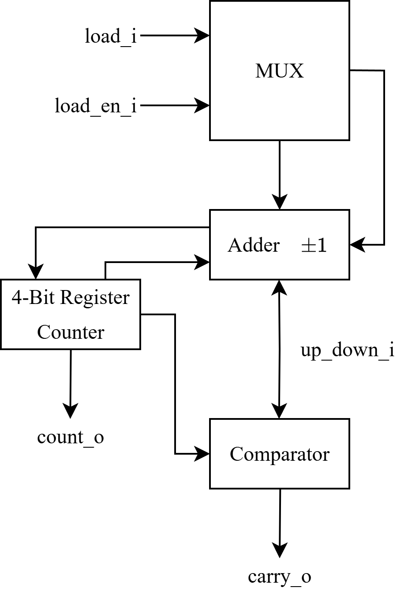

# Digital Systems Design and Verification - Homework 2

Solutions for all questions in Homework 2.

Schematics are shown below.

## Verilator Simulation

Simulation/verification is done using [Verilator](https://github.com/verilator/verilator). Verilator is a _super fast_ open-source Verilog/SystemVerilog simulator. Verilator compiles Verilog code to C++, therefore the testbenches can also be written in C++.

Testbenches are run using `Make`.

## Repository Structure

```
homework_2/
├── hdl/
│   ├── common/                 # Shared modules used across questions
│   │   └── mux.sv
│   │
│   ├── q1/                     # Question 1: Shift Register
│   │   ├── src/
│   │   │   ├── top.sv
│   │   │   └── shift_reg.sv    # Shift register implementation
│   │   ├── sim/
│   │   │   └── sim_main.cpp
│   │   └── Makefile
│   │
│   ├── q2/                     # Question 2: LFSR
│   │   ├── src/
│   │   │   ├── top.sv
│   │   │   └── lfsr.sv
│   │   ├── sim/
│   │   │   └── sim_main.cpp
│   │   └── Makefile
│   │
│   ├── q3/                     # Question 3: Up/Down Counter
│   │   ├── src/
│   │   │   ├── top.sv
│   │   │   └── counter.sv
│   │   ├── sim/
│   │   │   └── sim_main.cpp
│   │   └── Makefile
│   │
│   ├── q4/                     # Question 4: Frequency Divider
│   │   ├── src/
│   │   │   ├── top.sv
│   │   │   ├── freq_div.sv     # Frequency divider implementation
│   │   │   ├── counter_16.sv   # 16-bit counter using cascaded 4-bit counters
│   │   │   └── counter_4.sv    # 4-bit counter building block
│   │   ├── sim/
│   │   │   └── sim_main.cpp
│   │   └── Makefile
│   │
│   ├── q5/                     # Question 5: Register File
│   │   ├── src/
│   │   │   ├── top.sv
│   │   │   └── rf.sv           # Register file implementation
│   │   ├── sim/
│   │   │   └── sim_main.cpp
│   │   └── Makefile
│   │
│   └── Makefile                # Top-level build system
│
└── docs/
    └── homework_2.pdf
```

The SystemVerilog modules for each question can be found in the `src/` directory. Shared modules are stored in the `common/` directory. For simulation, the module in question is instantiated in a `top.sv` file which is then applied stimulus in the `sim_main.cpp` testbench.

## Prerequisites

- Verilator
- Make
- C++ compiler
- [VaporView](https://github.com/Lramseyer/vaporview) (VSCode extension for viewing waveform files `.vcd`)

## Building/Simulation

The act of _building_ a project with verilator means compiling the Verilog/SystemVerilog modules and running the testbench/simulation described in each project's `sim_main.cpp`.

Running `make` for a project will:

1. Verilate the SystemVerilog files
2. Compile the C++ testbench
3. Run the simulation
4. Create waveform dump (`logs/vlt_dump.vcd`)

### Building Using Top Level Makefile

To build all questions:

```bash
hdl> make
```

To build a specific question:

```bash
hdl> make q1
hdl> make q2
hdl> make q3
hdl> make q4
hdl> make q5
```

### Building Using Question Specific Makefile

```bash
hdl/q1> make
hdl/q2> make
# etc.
```

## Viewing Waveforms

After running a simulation, the waveform file can be found in `logs/vlt_dump.vcd` and can be viewed using [VaporView](https://github.com/Lramseyer/vaporview).

## Schematics

### Question 3



## Testbench Outputs

### Question 1

```console
--- Testing: Reset ---
After reset: parallel_out=0x00 (expected: 0x00)

--- Testing: Parallel Load (10100101)---
Parallel load 0x10100101: parallel_out=10100101, serial_out=1

--- Testing: Serial Shifting with 0s ---
Shift 1: parallel_out=01010010, serial_out=0
Shift 2: parallel_out=00101001, serial_out=1
Shift 3: parallel_out=00010100, serial_out=0
Shift 4: parallel_out=00001010, serial_out=0
Shift 5: parallel_out=00000101, serial_out=1
Shift 6: parallel_out=00000010, serial_out=0
Shift 7: parallel_out=00000001, serial_out=1
Shift 8: parallel_out=00000000, serial_out=0

--- Testing: Serial Shift with 1s ---
Loaded 0x00: parallel_out=00000000
Shift in 1 [1]: parallel_out=10000000, serial_out=0
Shift in 1 [2]: parallel_out=11000000, serial_out=0
Shift in 1 [3]: parallel_out=11100000, serial_out=0
Shift in 1 [4]: parallel_out=11110000, serial_out=0
Shift in 1 [5]: parallel_out=11111000, serial_out=0
Shift in 1 [6]: parallel_out=11111100, serial_out=0
Shift in 1 [7]: parallel_out=11111110, serial_out=0
Shift in 1 [8]: parallel_out=11111111, serial_out=1
```

### Question 2

```console
--- Testing: Reset ---
After reset: parallel_out=0x00 (expected: 0x00)

--- Testing: Parallel Load (10100101)---
Parallel load 0x10100101: parallel_out=10100101

--- Testing: Serial Shifting---
Shift 1: parallel_out=00000001
Shift 2: parallel_out=00000010
Shift 3: parallel_out=00000100
Shift 4: parallel_out=00001000
Shift 5: parallel_out=00010000
Shift 6: parallel_out=00100000
Shift 7: parallel_out=00001011
Shift 8: parallel_out=00010110
```

### Question 3

```console
--- Testing: Reset ---
After reset: count=0000 carry=0 (expected: 0000, 0)

--- Testing: Load value 0b1010 ---
After load: count=1010 carry=0 (expected: 1010, 0)

--- Testing: Count Up ---
Cycle 1: count=1011 carry=0
Cycle 2: count=1100 carry=0
Cycle 3: count=1101 carry=0
Cycle 4: count=1110 carry=0
Cycle 5: count=1111 carry=0
Cycle 6: count=0000 carry=1

--- Testing: Count Down ---
Cycle 1: count=1111 carry=1
Cycle 2: count=1110 carry=0
Cycle 3: count=1101 carry=0
Cycle 4: count=1100 carry=0
Cycle 5: count=1011 carry=0
Cycle 6: count=1010 carry=0
```

### Question 4

```console
--- Reset Test ---
--- Testbench ---
Changing edge at: 17
Interval: 17

Changing edge at: 883
Interval: 866

Changing edge at: 901
Interval: 18

Changing edge at: 1767
Interval: 866

Changing edge at: 1785
Interval: 18
```

### Question 5

```console
System reset.
Writing to all registers...
Completed...

Reading an verifying all registers (port 1)...
Completed with 0 errors...

Reading an verifying all registers (port 2)...
Completed with 0 errors...

Verifying reset...
System reset.
Completed with 0 errors...
```