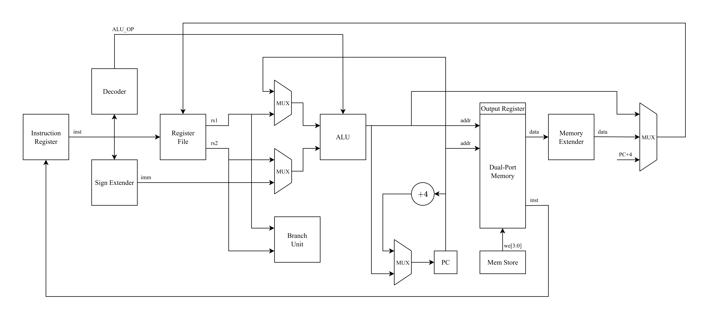

# Milestone 4 - Risc-V Core

In this milestone we implemented a _fully_ complient RV32I core (with the exception of environment calls).

The milestone everything necessary compilation under `programs`. For verification we created a C application that verifies more or less *every* RV32I instruction with inline assembly. The program is self-verifying. Things that have been verified:

- Register-To-Register arithmetic
- Register-Immediate arithmetic
- Logical operations
- Shift operations
- Branching
- Load/Store (words, halfwords, and bytes)
- Memory access patterns using arrays.

In addition a program for calculating primes was created as a demonstration. Note that all tested applications _also_ work with full `-O3` optimization.

Notable features of our implementation:

- For byte/halfword memory load and stores we implemented the `mem_ext_unit` and `mem_store_unit`.

- For decreasing the amount of clock cycles per instruction we utilize true dual-port, byte-addressable memory.

- For branching we have a dedicated `branch_unit`.

- For the decoding of immediates we have a `sign_ext_unit`.

- For output we implemented a memory-mapped output register.
